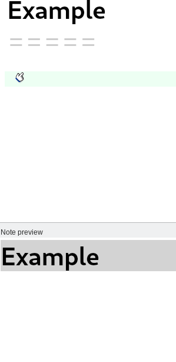
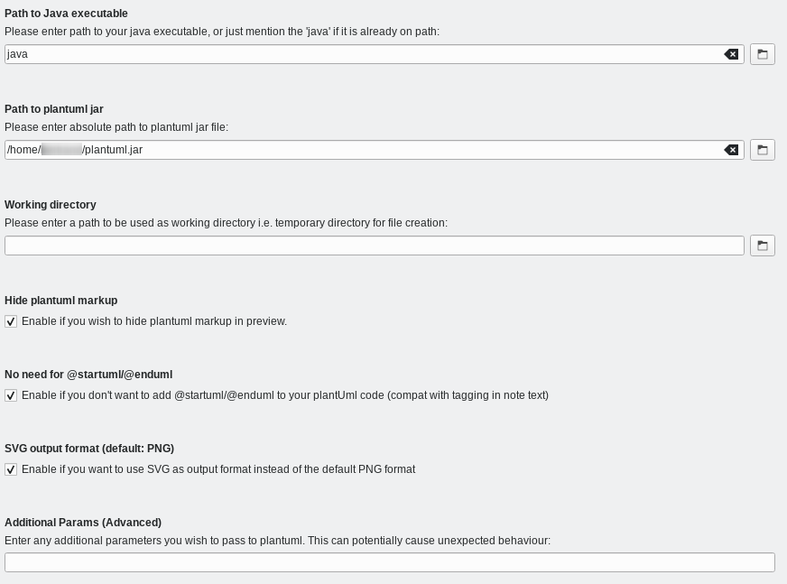

# Render PlantUML Diagrams for QOwnNotes editor

This script for [QOwnNotes](https://www.qownnotes.org/) renders text based diagram descriptions into image files using the program [PlantUML](https://plantuml.com/).

## Features

- Backround diagram rendering
- Offline rendering
- Cache system that renders only new or modified diagram descriptions
- Diagram rendering in PNG or SVG
- Context menu to add header/footer of most PlantUML diagram types

## Install

1. [Download PlantUML](https://plantuml.com/en/download) with GraphViz support.
2. Verify or install JAVA or OpenJDK.
3. If not installed, [install QownNotes](https://www.qownnotes.org/installation/).
4. In QOwnNotes, go to `Scripting`>`Find scripts in script repository` menu. And install `Support for PlantUML in notes`.
5. In the script parameters configure JAVA and `plantuml.jar` paths.  
   
6. Enjoy!

## Developpement

The script is developed on Github: https://github.com/qownnotes/scripts/tree/main/render-plantuml

Feel free to contribute.
